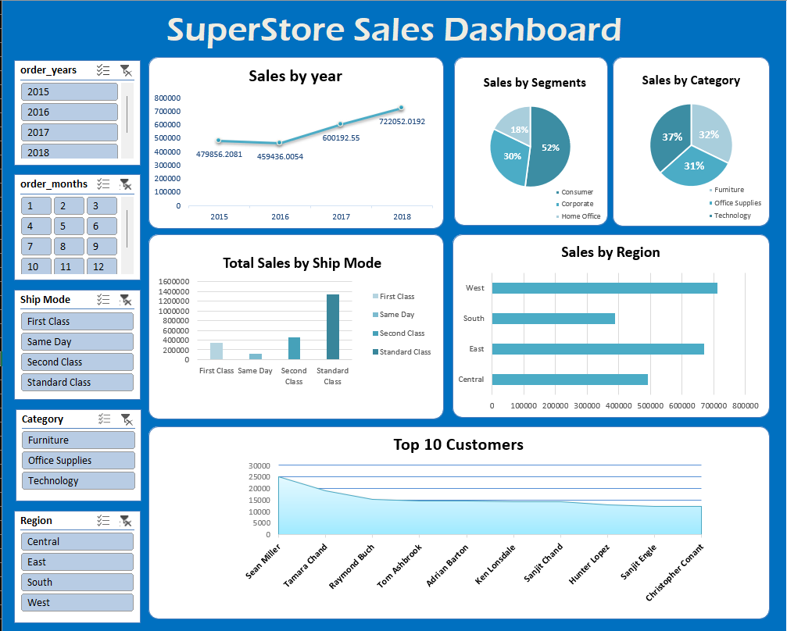

Excel Sales Performance Dashboard
Project Overview

This project is an interactive Excel dashboard built on the Superstore Sales Dataset. The dashboard provides insights into sales performance, customer behavior, and regional trends using Pivot Tables, Charts, and Slicers.

The goal of this project is to demonstrate data cleaning, business analysis, and visualization skills in Excel, which are crucial for data analysts and business intelligence roles.

Dataset

Source: Superstore sample dataset (commonly used in analytics case studies).

Size: 9,000+ records of orders.

Columns: Order Date, Ship Mode, Customer, Segment, Region, Product, Sales, etc.

 Dashboard Features

✔️ KPI Cards

Total Sales

Total Orders

Total Customers

Average Order Value

✔️ Interactive Analysis

Sales Trend by Month & Year

Sales by Category & Sub-Category

Regional Performance (East, West, Central, South)

Customer Segment Contribution (Consumer, Corporate, Home Office)

Top 10 Customers by Sales

Sales by Ship Mode

✔️ Slicers & Filters

Category

Region

Segment

Year

 Dashboard Screenshots

(Add your images here after saving them in a /visuals folder in your repo)

Example:

Key Insights

Technology is the highest revenue-generating category.

The West region contributes the most sales, while the South lags.

The Consumer segment accounts for nearly half of all sales.

Top 10 customers generate ~20% of total revenue.

Standard Class shipping is the most preferred mode.

Tools & Skills Used

Microsoft Excel

Pivot Tables & Pivot Charts

Slicers & Interactive Filters

Conditional Formatting

Dashboard Design

How to Use

Download the Excel file: sales_dashboard.xlsx

Open in Microsoft Excel (2016 or later recommended).

Use slicers to interact with the dashboard and explore different insights.

